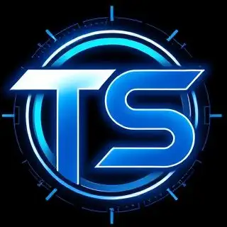

# 🎬 Title Seeker

<div id="title-seeker" align="center">
  

**A powerful title discovery platform built with modern web technologies**

</div>

---

## ✨ Features

- 🎨 **Modern UI** - Beautiful, responsive design with dark/light themes
- 🌍 **Internationalization** - Multi-language support
- 📱 **Mobile Responsive** - Optimized for all device sizes
- ⚡ **Fast Performance** - Built with Next.js for optimal speed

---

## 🛠️ Tech Stack

<table>
  <tr>
    <td align="center">
      
      <br><strong><a href="https://nextjs.org/" target="_blank">Next.js</a></strong>
      <br><sub>React Framework</sub>
    </td>
    <td align="center">
      
      <br><strong><a href="https://www.typescriptlang.org/" target="_blank">TypeScript</a></strong>
      <br><sub>Type Safety</sub>
    </td>
    <td align="center">
      
      <br><strong><a href="https://tailwindcss.com/" target="_blank">TailwindCSS</a></strong>
      <br><sub>Styling</sub>
    </td>
    <td align="center">
      
      <br><strong><a href="https://ui.shadcn.com/" target="_blank">Shadcn/ui</a></strong>
      <br><sub>UI Components</sub>
    </td>

  </tr>
  <tr>
    <td align="center">
      
      <br><strong><a href="https://orval.dev/" target="_blank">Orval</a></strong>
      <br><sub>API Generation</sub>
    </td>
    <td align="center">
      
      <br><strong><a href="https://playwright.dev/" target="_blank">Playwright</a></strong>
      <br><sub>E2E Testing</sub>
    </td>
    <td align="center">
      
      <br><strong><a href="https://vitest.dev/" target="_blank">Vitest</a></strong>
      <br><sub>Unit Testing</sub>
    </td>
    <td align="center">
      
      <br><strong><a href="https://www.docker.com/" target="_blank">Docker</a></strong>
      <br><sub>Containerization</sub>
    </td>
  </tr>
</table>

---

## 🚀 Getting Started

### Installation

1. **Clone the repository**

   ```bash
   git clone <repository-url>
   cd title-seeker-frontend
   ```

2. **Install dependencies**

   ```bash
   npm install
   # or
   yarn install (I use)
   # or
   pnpm install
   # or
   bun install
   ```

3. **Set up environment variables**

   Create a `.env` file in the root directory:

   ```env
   ⚠️ Ask the owner for credentials ⚠️
   ```

4. **Generate API client**

   ```bash
   yarn gen-api
   ```

   If the schemas have changed on the backend, run this command, and then repeat the previous one:

   ```bash
   yarn get-openapi
   ```

5. **Run the development server**

   ```bash
   npm run dev
   # or
   yarn dev
   # or
   pnpm dev
   # or
   bun dev
   ```

6. **Open your browser**

   Navigate to [http://localhost:3000](http://localhost:3000) to see the application.

---

## 📝 Scripts

| Command           | Description                            |
| ----------------- | -------------------------------------- |
| `dev`             | Start development server               |
| `build`           | Build for production                   |
| `start`           | Start production server                |
| `lint`            | Run ESLint                             |
| `type-check`      | Run a typescript check                 |
| `get-openapi`     | Get API schemas from backend (Swagger) |
| `gen-api`         | Generate API client with Orval         |
| `test`            | Run Vitest unit tests                  |
| `test-playwright` | Run Playwright E2E tests               |

---

## 🧪 Testing

### Unit Tests (Vitest)

```bash
yarn test
```

### End-to-End Tests (Playwright)

```bash
yarn test-playwright
```

For E2E it is better to use an <strong><a href="https://marketplace.visualstudio.com/items?itemName=ms-playwright.playwright" target="_blank">extension</a></strong>

---

## 🌍 Internationalization

The application supports multiple languages using **next-intl**:

- English (en)
- Ukrainian (uk)

Translation files are located in the `messages/` directory.

---

## 🐳 Docker Deployment

Changes are pushed to the docker hub repository and then pulled on the server.
For hotfixes there is a quick script, and after significant changes it is better to use git actions. To do this you need to create a runner on your machine.

---

## 🔢 Versioning

After changes in the project, the version should be updated. This is done with a script:

```bash
sh version.sh patch/minor/major
```

---

<div align="center">
  <p>
    <a href="#title-seeker">Back to top</a>
  </p>
</div>
